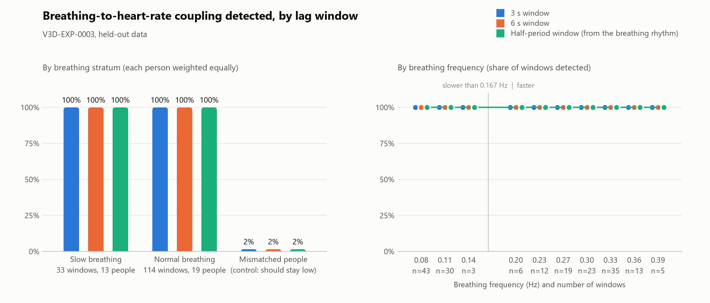

# rain-pipeline

## A note 

I built **rain-pipeline** because I kept running into the same problem from different directions: a scientific result can look rigorous long before anyone has a reliable way to separate what was *noticed*, what was *measured*, and what was actually allowed to count as evidence.

I do not want another system that asks the reader to trust the researcher, the model, the paper, or even the software. I want the machinery of the claim to be visible.

That is the idea behind this repository. I am building a research system in which an observation can remain an observation, a hypothesis can be registered before it is tested, evidence can be tied to the exact bytes and code that produced it, failures can stay in the record, and another person can replay the result without needing to believe me first.

This is also how I think about my broader work at **Vers3Dynamics**. The point is not to manufacture certainty. The point is to build instruments that make uncertainty, provenance, and evidence harder to hide.

I am particularly interested in the boundary between human judgment and machine judgment. R.A.I.N. is not here to become an oracle. It is here to make the rules explicit, apply them consistently, and leave a trail that someone else can inspect.

So this README is intentionally a little more personal than a normal software README. The code is the artifact. The repository is the laboratory notebook. And the standard I am trying to hold myself to is simple:

> **Do not ask people to trust the result when you can give them the means to check it.**

Everything that follows is an attempt to make that sentence executable.

## I. The problem is not dishonesty

The conscious and intelligent separation of what a researcher has *noticed* from what a researcher has *shown* is an important element in modern science. Those who maintain that separation constitute an invisible discipline. That discipline, not the eminence of the researcher and not the confidence of the prose, is the true source of a result's authority.

We're persuaded, our confidence won and our doubts settled, largely by mechanisms we have never examined. This is the natural consequence of the way the modern laboratory is organised. One mind looks at the data, forms a wish, writes the criteria, takes the measurement and announces the verdict; and the public, having no means of telling these five acts apart, hears them in one voice.

rain-pipeline is an instrument for giving them separate voices. It takes a question to a verdict on real data, and it keeps four things from being mistaken for one another:

| | where it lives | may it decide a verdict? |
|---|---|---|
| something we **noticed** | `explorations/`: analyses of data already seen, labelled exploratory | never |
| something we **registered** | `experiments/<ID>/experiment.json`: write-once criteria, anchored by a git commit before the data is read | it defines what would |
| something we **measured** | `runs/` and the R.A.I.N. run record: the registered measurements, each bound by hash to the bytes it came from | no; it is the input |
| something the **registered criteria support** | the verdict R.A.I.N. computes from those measurements and those criteria alone | yes, and nothing else does |

## II. Three sentences the public can carry

The group mind does not carry arguments. It carries phrases, and a principle the public can repeat is worth more than a proof it cannot. The instrument rests on three.

- **Inference is not evidence.** Explorations, the literature panel and every output a study computes but did not register stay description. None of them is ever submitted or evaluated.
- **Evidence is not permission.** A result cannot change its own criteria, reuse a holdout it has read, or speak for subjects it never saw. Registrations are write-once and git-anchored; a holdout is read once.
- **Confidence is not authority.** A verdict is as strong as the chain beneath it, no stronger. `verify` re-derives every link and grades every claim; `replay` re-executes it.

## III. On the wish, which is older than the observation

A relation of mine in Vienna spent his life demonstrating that the wish precedes the perception, and that the mind which holds the wish is the last to be told of it. Researchers who look at the data and then write the criteria are not frauds. They are human beings, and the ordinary laws of the human mind apply to them with full force.

Every earlier remedy asked researchers to be better than that. This instrument asks nothing of the kind. It assumes the wish, and it arranges matters so that the wish does not matter. The criteria are written down, sealed by hash, committed to a public history and pushed to a server the researcher does not control, before one byte of the data that could gratify them is read; and the ledger records that first read, by the machine's own clock, to the millisecond. Researchers remain free to hope. They are no longer free to adjust.

## IV. Who vouches, and why it is not the author

The public does not believe a maker. It believes an authority the maker did not hire. When a nation was to be persuaded to a heavier breakfast, the counsel did not praise bacon; the counsel wrote to five thousand physicians and reported what forty-five hundred of them replied.

No claim in this repository is certified by the people who wrote the software. Four parties certify it, and none of them answers to the author:

- **R.A.I.N., the judge.** It alone assigns a verdict, from the registered criteria and the submitted measurements and from nothing else. A submission carries no status. The author cannot pass their own experiment.
- **Anna, the librarian.** It searches arXiv, produces the cited record and seals it; the record is re-verified by hash at every later step. The R.A.I.N. panel that argues over Anna's sources may inform a registration. It may never write a criterion.
- **PhysioNet, the data.** Every byte range read from the public Fantasia database is logged once in an append-only ledger with its SHA-256 and the time and reader of its first read: 40 ranges, 142.7 MB, 20 people. A replay fetches the same bytes from the public server and refuses unless every hash agrees.
- **The git history, the witness.** The first commit that holds a registration is its timestamp, and a push to GitHub is the only moment anyone outside the machine can attest to. `verify` reads that history. It does not read the author's word.

Each stage calls the upstream code in-process at a pinned commit (Anna, R.A.I.N. and DRR are submodules under `vendor/`). Nothing is copied or forked. Every run records which code ran, and `verify` maps that record back to the exact commit.

## V. The overt act

Opinion is not moved by argument. It is moved by an event the public can witness. When a nation was to be reminded what it owed the electric lamp, the counsel did not publish an essay; he arranged for the lamps of a continent to be dimmed and relit at an appointed hour, with the inventor present.

The event this instrument stages is smaller, and it is public. On 4 October 2026, at 17:41:53 UTC, commit `4b4a030` placed the criteria for V3D-EXP-0002 and V3D-EXP-0003 in the history of this repository, and that commit was pushed before the first byte of their held-out data was read. The commit, the push and the ledger are all open to inspection, and a reader who inspects them concludes without taking anyone's word for it.

The mechanism, in full:

```
question
  ├─ explore ──── seen bytes only, labelled "not evidence" ──────────────────────┐ (hash)
  ▼                                                                              ▼
register ── refuses first: malformed spec, a definition R.A.I.N. rejects, a metric the study never
         │  produces, an unguarded or already-read holdout, an unacknowledged shared holdout
         ├─ Anna: arXiv → hybrid search → cited record, sealed + re-verified
         ├─ R.A.I.N. panel argues over Anna's sources (context, never criteria)
         └─ write-once rain-experiment/v1 binding, by SHA-256: literature record, panel corpus,
            parent result, exploration, holdout ranges, the ledger as it was
git commit + push ── the anchor: the first commit that holds the registration
run ── refuses an unanchored or edited registration, a changed dossier, (holdout) unpinned code
    ├─ PhysioNet byte ranges, each first read logged once in the append-only data/ledger.json
    ├─ DRR study: real pairs + mismatched-person + synthetic positive and null controls
    └─ submission with no status ─► R.A.I.N. alone evaluates the registered criteria
         (any failure after the first read is still filed: an `error` run, never a lost one)
verify ── re-derives every link from the files and git history; grades each claim
replay ── re-executes a run from its registration alone; writes a receipt comparing every value
```

## VI. The record

The counsel's first instinct is to lead with a success. The counsel's considered advice is to lead with the failure, because a method that has never reported one has never been tested, and the public knows it.

Of three registered experiments, one failed. Its criteria were pushed to a public server before the data was read; the data was read; the hypothesis did not hold; the verdict was filed and published unchanged. That row is the strongest claim this repository makes.

| experiment | question | data | verdict (assigned by R.A.I.N.) | evidence level |
|---|---|---|---|---|
| [V3D-EXP-0001](runs/20261004T150406Z/REPORT.md) | Does DRR recover respiration → heart-rate coupling at rest? | 20 people × 10 min | **PASSED**: 18 of 20 detected; 1 of 20 mismatched pairs | registered: criteria recorded before the run, not git-anchored |
| [V3D-EXP-0002](runs/20261004T174209Z/REPORT.md) | Do slow breathers escape a 3 s lag window, and does 6 s recover them? | held out: 190 windows | **FAILED** (F1): nothing to recover; 3 s already detected 33 of 33 slow windows | confirmatory: anchored in `4b4a030` and pushed before any holdout byte was read |
| [V3D-EXP-0003](runs/20261004T181106Z/REPORT.md) | Can the lag window come from the breathing rhythm (half its period)? | held out: 190 windows | **PASSED**, at ceiling: matches both fixed windows (100%); mismatched 3 of 190 | confirmatory: same anchor, same held-out windows as 0002 |

Evidence levels follow mechanically from `python -m rain_pipeline verify` ([how](docs/EVIDENCE.md)); `python -m rain_pipeline lineage` prints the chain behind each row. Two facts the levels make explicit, and the counsel is instructed not to soften: V3D-EXP-0002 and 0003 form a family judged on the same held-out bytes with no correction across them, and their held-out data is new data from the same 20 people, not new people.

**Replays.** A result the public can only read is a rumour. A result the public can re-execute is a fact. Each run was re-executed from its registration alone, from the public PhysioNet bytes (every byte hash-identical to the ledger), by the committed 0.3.0 code on Linux; the originals ran on Windows. Receipts are in `replays/`, and `verify` checks each one against the record it replays.

| run | receipt | outcome | registered measurements | largest descriptive difference |
|---|---|---|---|---|
| V3D-EXP-0001-RUN-0001 | [2026-10-04, Python 3.11.15, numpy 2.4.6, scipy 1.17.1](replays/V3D-EXP-0001/RUN-0001-20261004T200834Z.json) | `measurements-reproduced` | 11 of 11 identical, same verdict | 7.3e-15 |
| V3D-EXP-0002-RUN-0001 | [2026-10-04, Python 3.11.15, numpy 2.4.6, scipy 1.17.1](replays/V3D-EXP-0002/RUN-0001-20261004T201606Z.json) | `measurements-reproduced` | 24 of 24 identical, same verdict | 7.9e-15 |
| V3D-EXP-0003-RUN-0001 | [2026-10-04, Python 3.11.15, numpy 2.4.6, scipy 1.17.1](replays/V3D-EXP-0003/RUN-0001-20261004T202718Z.json) | `measurements-reproduced` | 24 of 24 identical, same verdict | 7.9e-15 |

The largest difference between any original and its replay is eight parts in a quadrillion.



*The interpretation below was written after the runs, in 0.2.0. It mixes registered outcomes (the verdicts and detection rates) with description (correlation sizes, lags, QC observations); only the registered outcomes are evidence. The counsel has been permitted to touch the wording and not the numbers.*

### What the held-out data says

V3D-EXP-0001 missed two people, f2y09 and f2y10, who both breathe slowly. That suggested the 3 s lag window was too short for slow breathing. Two experiments put the suggestion to 6,000 s per person that had never been read, with their criteria pushed to GitHub (`4b4a030`) before the first byte was fetched. The idea did not survive, and the record of its end is intact:

- **The coupling is too strong to miss in 10 minutes.** Within a person, breathing and heart rate correlate at a median |r| of 0.53, against 0.055 for mismatched people. Under the 3 s window, 171 of 190 windows reach the smallest p-value 199 surrogates allow (0.005), and none exceeds 0.020. Every lag window detects every window, including 43 windows breathing slower than the slow stratum (0.063–0.078 Hz).
- **So V3D-EXP-0002 fails, and V3D-EXP-0003's pass is weak.** The 6 s window had no gain to show. The breathing-derived window matching both fixed windows at 100% shows that it costs nothing. It does not show that it helps, because these windows could not tell the arms apart. Both outcomes stand as registered.
- **Truncation is real but rare.** *Description, not evidence.* In 6 of 76 slow or very slow windows, the 3 s window's best lag sat at its 3 s edge. The 6 s window found the true peak further out in 5 of them, with a lower p-value. None changed a detection.
- **f2y09's miss looks like signal quality, not lag.** All 10 of its held-out windows fail the pre-registered beat QC (86–94% valid RR intervals). Its V3D-EXP-0001 window passed at 95.3%, just over the 95% bar, and showed almost no coupling (|r| 0.03). Noisy ECG or frequent ectopic beats would both do this; the band-pass detector cannot tell which. f2y10 is detected in all 10 held-out windows; its V3D-EXP-0001 window was the exception.
- **The exploration's warning did not replicate.** On seen data the 6 s window fired on 4 of 20 mismatched pairs. On held-out data each lag window fired on 3 of 190.

**Next experiment** (not yet registered, and therefore not yet anything): escape the ceiling, so the arms can disagree. Use shorter windows (about 2 min) and the older Fantasia cohort (f1o/f2o). Nobody has read any of its bytes, and its weaker age-related coupling lowers the ceiling. Choose the window length by exploring on the seen young-cohort data first. Separately, a beat detector that flags ectopic beats would show whether f2y09 can be analysed at all.

Earlier on V3D-EXP-0001: heart rate → respiration was also detected in 90% of records, as its pre-registered limitation predicted, so it shows coupling, not direction. Its first attempt (`runs/20261004T145937Z`) crashed before submitting and is kept with a `CRASHED.txt`.

## VII. The protocol, and what each step refuses

A guarantee the public can state is worth more than one it must trust. Each step of the protocol is therefore defined by what it refuses to do.

| step | command | guarantee |
|---|---|---|
| explore | `explore SPEC` | Reads only bytes the ledger has already seen; refuses anything else, and refuses a spec that declares a holdout. It checks the ledger and never writes it. The report is labelled *not evidence*. |
| register | `register SPEC` | Refuses before any literature search or data access if the spec is malformed, R.A.I.N. would reject the definition, a registered metric is one the study never produces, a holdout lacks a zero-early-reads guard, any holdout byte was ever read, or the holdout overlaps another registered one without `data.holdout_shared_with`. It then dry-runs the analysis on synthetic data. Writes a write-once registration that binds, by SHA-256, the Anna record, the panel corpus, the parent result, the exploration report and the ledger snapshot. |
| anchor | `git commit && git push` | The first commit that holds the registration is its timestamp. Every later commit must hold the identical file. GitHub shows the criteria existed before the data was read. |
| run | `run SPEC` | Refuses an uncommitted or edited registration and a framing dossier that no longer matches it. For a holdout it also refuses `--allow-uncommitted` and uncommitted or unpinned code. Holdout reads wait until they are provably later than the anchor. Logs every first read. Submits exactly the registered metrics, with no status, plus `holdout_bytes_read_before_registration` and `holdout_bytes_read_before_anchor` for R.A.I.N. to judge. Any failure after the first read is filed as an `error` run. |
| verify | `verify` | R.A.I.N. re-derives every stored result. Every hash, binding, anchor, ledger version, holdout time and record is re-checked against the files and git history ([checks](docs/EVIDENCE.md#what-verify-checks)). |
| replay | `replay EXP-ID` | Re-executes a recorded run from its registration alone, refuses unseen bytes, and writes a receipt comparing every registered measurement, series and study-report value. |

Registrations never change. If a spec no longer matches its stored registration, `run` refuses and `verify` fails. A changed idea needs a new title, a new spec file and a new registration. A crash after registration is recorded as an R.A.I.N. `error` run, distinct from a failed hypothesis.

The data ledger is a log kept by this tool. It makes the holdout claim checkable and prevents accidents; it cannot rule out reads made outside the pipeline.

## VIII. Documentation

- [Architecture](docs/ARCHITECTURE.md): who may decide what, the modules, and every invariant with the mechanism that enforces it and the test that proves it.
- [Protocol](docs/PROTOCOL.md): the contributor contract, what each command refuses, and how to add a study or a data source.
- [Evidence](docs/EVIDENCE.md): every `verify` check, the evidence levels, replay outcomes and receipts, and the evidence graph format.
- [Changelog](CHANGELOG.md): what changed in each version; every run records the version and commit that produced it.

## IX. Setup

The counsel does not improve upon the mechanic's instructions. They are reproduced exactly.

```bash
git clone --recurse-submodules https://github.com/topherchris420/rain-pipeline.git
cd rain-pipeline
python3.11 -m venv .venv            # Python 3.10-3.12
.venv/bin/pip install -c constraints.txt -e ".[dev]"
.venv/bin/pip install --no-deps -e vendor/dynamic-resonance-rooting
```

On Windows use `.venv\Scripts\python.exe -m pip …`; with uv, `uv venv --python 3.11 .venv` then `uv pip install --python <venv python> …` with the same arguments.

`constraints.txt` pins the environment the committed results were replayed in. numpy 2.4.6 and scipy 1.17.1 are also what every committed run recorded. Anna, R.A.I.N. and DRR are git submodules under `vendor/`, pinned to the commits that produced the committed results (anna `064af91`, james_library `9c8811e`, DRR `862c4f7`). Moving a submodule or a numeric dependency is a code change: replay the committed experiments, then rely on new results.

Anna needs PostgreSQL. `pgserver` bundles Postgres 16 + pgvector and runs it from `.pgdata/` only while `register` needs it.

## X. Commands

```bash
python -m rain_pipeline explore specs/explore-lag-window.json
python -m rain_pipeline register specs/<new-spec>.json
python -m rain_pipeline run specs/<registered-spec>.json
python -m rain_pipeline verify [--strict] [--json]
python -m rain_pipeline replay V3D-EXP-0002 [--run RUN-0001] [--no-write]
python -m rain_pipeline lineage [--json]
python -m rain_pipeline publish        # regenerate RESULTS.md from the registry
python -m pytest
```

`rain-pipeline` is installed as the same command. `--root DIR` (or `RAIN_PIPELINE_ROOT`) points every command at another evidence repository.

| exit | meaning |
|---|---|
| 0 | a recorded outcome (passed, failed or inconclusive), a clean verify, or a replay whose registered measurements reproduced |
| 1 | verify found a broken link (or, with `--strict`, a check it could not run), or a replay's measurements or verdict differ |
| 2 | refused: nothing was read, registered or recorded; one line says why |
| 3 | a run or replay was recorded as an error |

- DRR tests run in parallel across CPU cores (spawned workers, each seeded on its own); results are identical to a single process. `RAIN_PIPELINE_WORKERS=1` forces one process.
- The test suite is offline. A fake PhysioNet and a sealed fake Anna record drive the real protocol end to end. One test replays V3D-EXP-0001 from the cached public bytes, and is skipped until `replay` has filled the cache.

## XI. Writing a new experiment

Copy a spec from `specs/` to a **new file name** and edit it. Every section is checked, and every problem is reported at once, before anything runs:

- **`literature`**: arXiv queries for Anna's index, and the search that becomes the cited record.
- **`lineage`** (optional): the result it follows (`V3D-EXP-NNNN/RUN-NNNN`), what was observed, and the exploration report that motivated it (it must be one).
- **`data`**: records, segments, QC. `"holdout": true` makes register and run enforce that the data is unseen. A holdout that overlaps another registered holdout must name it in `"holdout_shared_with"` (and say so in the limitations): the family is then on the record before anything is measured.
- **`analysis`**: the DRR study (`rsa_coupling` or `lag_window`) and its settings, checked against the study's contract. These become the registration's parameters.
- **`preregistration`**: the R.A.I.N. definition: hypothesis, metrics, guards, success and failure criteria, limitations. Every metric must be one the study (or, for a holdout, the pipeline) produces. A holdout needs a guard `{"metric": "holdout_bytes_read_before_anchor", "op": "<=", "value": 0}` (or the `…_before_registration` one).

Only metrics declared in the registration are submitted. Those a criterion reads decide the verdict. The other registered metrics are submitted as description. Everything else a study computes stays in `drr_report.json` as description. Each run's `REPORT.md` lists all three tiers. [docs/PROTOCOL.md](docs/PROTOCOL.md) is the full contributor contract.

## XII. Layout

| path | what |
|---|---|
| `specs/` | experiment and exploration specs (human intent) |
| `explorations/` | exploratory reports and figures on seen data; never evidence |
| `framing/<spec>/` | Anna record, panel transcript and corpus, and `framing.json`, fixed at registration |
| `experiments/`, `RESULTS.md` | R.A.I.N.'s registry and its generated results page (do not edit by hand: `verify` compares it with the registry) |
| `runs/<UTC time>/` | `submission.json`, `REPORT.md`, `figure.png`, `drr_report.json`, `summary.json` |
| `replays/<EXP-ID>/` | reproducibility receipts |
| `data/ledger.json` | every byte range read, with its SHA-256 and the time and reader of its first read; append-only |
| `constraints.txt` | the pinned environment |
| `rain_pipeline/` | the code ([architecture](docs/ARCHITECTURE.md)) |

## XIII. What we decline to claim

Candour is a device, and it is the only device that survives a second reading. The limits below are stated by the makers, and stated first, before anyone else can state them.

- **The panel is R.A.I.N.'s offline mode.** Its quotes are verbatim and verified; its reasoning text is scripted. It informs the pre-registration and never writes criteria. When the retrieved abstracts do not address the question, it says so (grounding `none`), as it did for V3D-EXP-0002 and 0003.
- **Anna uses its deterministic hashing embeddings**: lexical retrieval over arXiv metadata and abstracts, not semantic search.
- **Experiment IDs are local to this repo.** R.A.I.N. numbers experiments per registry, so `rain-pipeline/V3D-EXP-0001` is not james_library's `V3D-EXP-0001`.
- **V3D-EXP-0001 predates the protocol.** It was registered before its data was fetched, but the registration was not committed before the run. The ledger shows two of its 20 records (f1y01, f2y01) were first read by an R-peak dry check that computed no coupling statistic. Its framing files were copied into `framing/cardiorespiratory/` byte for byte. `verify` rates it `registered`, not `confirmatory`, and lists its crashed first attempt.
- **Time is local.** The ledger's times and git's commit times come from the machine that made them. Git records whole seconds, so a read within the anchor's own second counts as early. A push to GitHub is the only externally witnessed time, and `pushed_to` records which remote branches held the anchor when the run started, as far as the local clone knew.
- **SHA-256 detects change; it is not a signature.** A writer able to rewrite records, files and git history together can forge them. Pushed history is the tamper-evidence layer.

## XIV. A note on method, from the counsel

A reader who has come this far has been worked upon by six devices, and in the spirit of Section XIII they are named.

1. **The cause before the product.** The public did not want a paper cup until it had learned to fear the common glass. This document sells a distinction, between noticing and showing, and lets the instrument ride in behind it.
2. **Authority the maker did not hire.** Physicians, in the matter of breakfast. Here, a judge, a librarian, a public database and a git log, each of which the reader can query directly.
3. **The overt act.** The lamps of a continent at an appointed hour; here, one pushed commit, timestamped before the data was read.
4. **The phrase the group can carry.** A cigarette once became a torch by being renamed. The three sentences in Section II do the same work, with the difference that each of them is also true.
5. **The failure as advertisement.** V3D-EXP-0002 is placed where the success would ordinarily go.
6. **Candour.** Section XIII, and this one.

Some devices were declined. No committee was founded to lend the instrument a letterhead. No physicians were polled. No living scientist's name has been attached to this document, and no figure in it comes from anywhere but the repository and its ledger.

One sentence from Section II applies to the counsel exactly as it applies to everyone else. Confidence is not authority. The counsel is confident. The reader is asked not to believe the counsel, but to run the check that does not care who wrote this page:

```bash
python -m rain_pipeline verify
```
