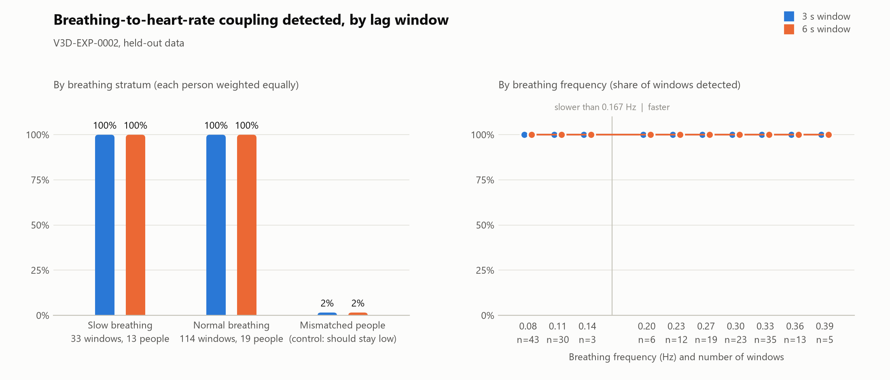

# V3D-EXP-0002-RUN-0001: FAILED

**Does a 6 s lag window recover respiration-to-heart-rate coupling in slow breathers? (held-out Fantasia windows)**

- Question: Do slow breathers escape DRR's coupling test because its 3 s lag window is shorter than half a breath, and does a 6 s window recover them?
- Hypothesis: In held-out 10-minute windows from the Fantasia young cohort (seconds 660-6660 of each record), widening the lag window from 3 s to 6 s raises the subject-balanced detection rate of respiration -> heart-rate coupling in slow-breathing windows (dominant breathing frequency from 0.0833 Hz up to, but not including, 0.1667 Hz) by at least 0.10, to at least 0.80, lowers it by no more than 0.05 in normal-breathing windows, and keeps detections between mismatched people at or below 0.10.
- Verdict (assigned by R.A.I.N. `rain-criteria/v1`): not supported
- Failure criterion triggered: F1. The hypothesis is not supported.
- R.A.I.N. re-verification: OK (1 run(s) re-derived from stored data)

## Criteria

| Id | Metric | Needs | Observed | Holds |
|---|---|---|---|---|
| G1 | `holdout_bytes_read_before_registration` | <= 0 | 0 | True |
| G2 | `windows_analyzed` | >= 160 | 190 | True |
| G3 | `slow_subjects` | >= 4 | 13 | True |
| G4 | `slow_windows` | >= 20 | 33 | True |
| G5 | `synthetic_long_lag_detection_rate_long` | >= 0.9 | 1 | True |
| G6 | `synthetic_null_false_positive_rate_long` | <= 0.15 | 0 | True |
| S1 | `slow_detection_rate_long` | >= 0.8 | 1 | True |
| S2 | `slow_gain_long_vs_short` | >= 0.1 | 0 | False |
| S3 | `normal_change_long_vs_short` | >= -0.05 | 0 | True |
| S4 | `mismatched_detection_rate_long` | <= 0.1 | 0.01579 | True |
| F1 | `slow_gain_long_vs_short` | <= 0 | 0 | True |
| F2 | `normal_change_long_vs_short` | < -0.15 | 0 | False |
| F3 | `mismatched_detection_rate_long` | > 0.15 | 0.01579 | False |

## Registration

- Registered: 2026-10-04T17:41:16.253Z
- Git commit: `4b4a0306b9ccb43ec6c32235190680684564326a` (2026-10-04T13:41:53-04:00); pushed to origin/main
- Holdout: 0 bytes of this data had been read before registration
- Follows: V3D-EXP-0001/RUN-0001. RUN-0001 missed two of 20 records (f2y09, f2y10), both breathing near 0.11-0.13 Hz, and detected a third slow breather (f1y03) only at the 3 s edge of the lag window.
- Exploration on seen data (not evidence): `explorations/20261004T173027Z-explore-lag-window/report.json`

## Literature (Anna)

Record `23d5f15aee83e17733d59d132cda6870da76fcc91392d9da654364cd961bfd28`

1. [Mathematical and Preclinical Investigation of Respiratory Sinus Arrhythmia Effects on Cardiac Output](http://arxiv.org/abs/2004.11325v1)
2. [Analysis of Respiratory Sinus Arrhythmia with Neural Networks](http://arxiv.org/abs/2609.05698v1)
3. [Disentangling Respiratory Sinus Arrhythmia in Heart Rate Variability Records](http://arxiv.org/abs/1802.00683v1)
4. [The Evaluation of Breathing 5:5 effect on resilience, stress and balance center measured by Single-Channel EEG](http://arxiv.org/abs/2507.10175v1)
5. [NEFFY 2.0: A Breathing Companion Robot: User-Centered Design and Findings from a Study with Ukrainian Refugees](http://arxiv.org/abs/2604.15325v1)
6. [Deriving the respiratory sinus arrhythmia from the heartbeat time series using Empirical Mode Decomposition](http://arxiv.org/abs/q-bio/0310002v1)
7. [Buffering blood pressure fluctuations by respiratory sinus arrhythmia may in fact enhance them: a theoretical analysis](http://arxiv.org/abs/1007.2229v1)
8. [Hand-breathe: Non-Contact Monitoring of Breathing Abnormalities from Hand Palm](http://arxiv.org/abs/2212.06089v1)

> the respiratory sinus arrhythmia. [1] Respiratory sinus arrhythmia (RSA) is heart rate variability in synchrony with respiration although its functional significance not clear. [2] Different measures of heart rate variability and particularly of respiratory sinus arrhythmia are widely used in research and clinical applications. [3] Slow-paced breathing is a promising intervention for reducing anxiety and enhancing emotional regulation through its effects on autonomic and central nervous system function. [4] The paper introduces a neural network-based approach for analyzing ECG signals to estimate respiratory rate by leveraging the phe- nomenon of Respiratory Sinus Arrhythmia (RSA). [5]

## Research panel (R.A.I.N., offline)

- Grounding: none
- Agreed: The local library has no evidence on this question, so the room made no claims about it.
- Contested: Nothing yet. A disagreement needs evidence on the table first.
- Next move: Add two or three papers on this topic to the library and rerun the same command, or connect a local model for an open-ended meeting.

## Data

PhysioNet Fantasia 1.0.0 (ODC-By 1.0): 20 records × 10 window(s) of 600 s from t=660 s. Analyzed 190; excluded by QC 10.

Cite: Iyengar N, Peng C-K, Morin R, Goldberger AL, Lipsitz LA. Age-related alterations in the fractal scaling of cardiac interbeat interval dynamics. Am J Physiol 1996;271:R1078-R1084. Goldberger AL et al. PhysioBank, PhysioToolkit, and PhysioNet. Circulation 2000;101(23):e215-e220.

## Limitations (pre-registered)

- The held-out windows come from the same 20 people as V3D-EXP-0001: new data, not new people. Slow breathing is concentrated in a few of them, so rates weight each person equally and the guards require at least four slow breathers.
- Detection means max-statistic adjusted p <= 0.05 for respiration -> heart rate. Lagged correlation ignores sign and lag 0, so this tests coupling, not direction.
- Strata come from the dominant Welch peak of respiration (64 s segments, 0.0156 Hz resolution). Windows slower than 0.0833 Hz fall in neither stratum.
- Mismatched pairs share the time into the recording, and every subject watched the same film. A film-locked common response would raise mismatched detections and count against the hypothesis.
- Windows from one person are not independent, so mismatched and window-level shares are less certain than their counts suggest.
- R peaks come from a simple band-pass detector; windows below the QC threshold are excluded, not repaired.
- The holdout guarantee rests on this tool's data ledger: it shows no byte of these ranges was read through the pipeline before registration, and cannot rule out reads made outside it.
- A sibling experiment (specs/resonance-derived-window.json) was registered alongside this one and is judged on the same held-out windows. Each is evaluated on its own criteria; there is no correction across the two.
- Literature retrieval uses Anna's deterministic hashing embeddings (lexical, not semantic) over arXiv metadata and abstracts only.
